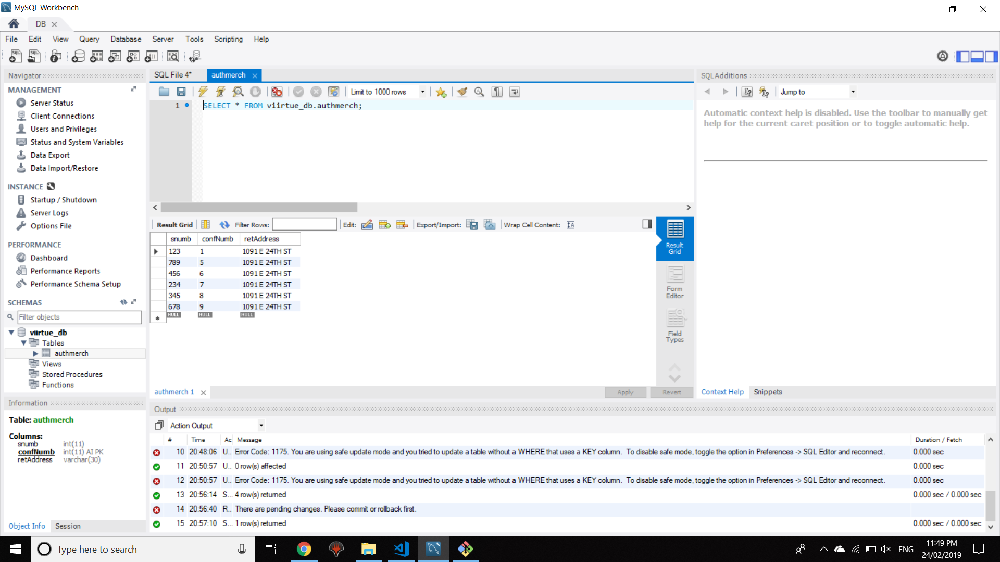

# ViirtueTest
Interview Test for Viirtue

# Question 1a

# Question 1b
The table consist of 3 columns; the serial number column "snumb", the confirmation number column, primary key,and auto increment "confNumb", and the return address "retAddress" which is set to default to 1091 E 24th st.

the overall program ensures that if the user entered a already existing value this gets queried and not re-inserted, furthermore if there is a new value, the new serial number becomes inserted into the authMerch table with a new generated confirmation number and a default return address.

# Question 2
Language: Javascript & Jquery

Keep entering emails to check whether the . or + will be removed and how is handled.
